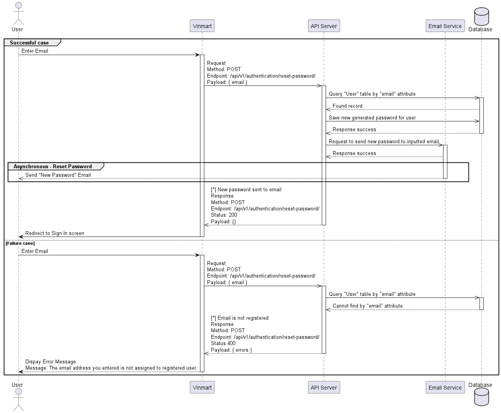

# Reset Password

## Sequence Diagram



---

## User Reset Password

Used to reset password for a registered User.

**URL:** `/api/v1/authentication/reset-password`

**Method:** `POST`

**Auth Required:** NO

**Request Data Constraints:**

```json
{
  "email": "[valid email address]"
}
```

**Request Data Example:**

```json
{
  "email": "iloveauth@example.com"
}
```

## Success Response

**Code:** `200 OK`

**Response Success Example:**

```json
{}
```

## Error Response

**[*] Condition:** If provided 'email' is not registered.

**Code:** `400 BAD REQUEST`

**Response Error Example:**

```json
{
  "method": "POST",
  "error": {
    "code": 400,
    "errors": [
      {
        "domain": "reset-password",
        "message": "The email address you entered is not assigned to registered user.",
        "locationType": "body",
        "location": "email"
      }
    ]
  }
}
```
