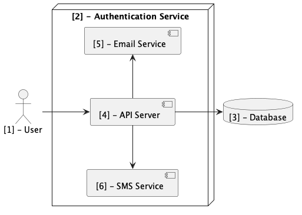

# Architecture Proposal

## Overview

This document propose the architecture of authentication mirco-service

## Architecture Diagram

### Architecture highlights

1. User
2. Authentication Service
3. Database
4. API Server
5. Email Service
6. SMS Service

## Glossary

### ExpressJS

- Express is a node js web application framework that provides broad features for building web and mobile applications. It is used to build a single page, multipage, and hybrid web application. It's a layer built on the top of the Node js that helps manage servers and routes.

### PostgresSQL

- PostgreSQL is a powerful, open source object-relational database system that uses and extends the SQL language combined with many features that safely store and scale the most complicated data workloads

### NodeMailer

- Nodemailer is a module for Node.js applications to allow easy as cake email sending. The project got started back in 2010 when there was no sane option to send email messages, today it is the solution most Node.js users turn to by default.

### Twillo

- Twilio is a cloud communications platform-as-a-service. It's offers developers a platform for building voice, video and messaging applications. The platform consists of a set of Application Programming Interfaces (APIs) that enables developers to make and receive voice and video calls, send and receive SMS, WhatsApp, and email, and perform other communication functions using its web service APIs.
