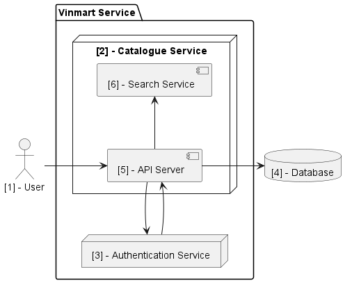

# Architecture Proposal

## Overview

This document propose the architecture of catalogue mirco-service

## Architecture Diagram

### Architecture highlights

1. User
2. Product Service
3. Authentication Service
4. Database
5. API Server
6. Search Service

## Glossary

### Algolia

- Algolia is an on-site search engine that includes analytics. It enriches the search experience with Autocomplete, filters, query suggestions and infinite scrolling.
- For developers, it offers back-end API clients, front-end widgets, several integrations, a customizable relevance algorithm and extensive documentation. It is usually described as having a developer-friendly API and an extensive toolset for development.
- Algolia is a more full-service search provider, but can still be built up further.
