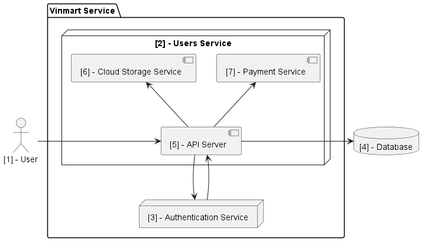

# Architecture Proposal

## Overview

This document propose the architecture of user mirco-service

## Architecture Diagram

### Architecture highlights

1. User
2. Product Service
3. Authentication Service
4. Database
5. API Server
6. Cloud Storage Service
7. Payment Service

## Glossary

### Amazon S3

- Amazon Simple Storage Service (Amazon S3) is an object storage service that offers industry-leading scalability, data availability, security, and performance. Customers of all sizes and industries can use Amazon S3 to store and protect any amount of data for a range of use cases, such as data lakes, websites, mobile applications, backup and restore, archive, enterprise applications, IoT devices, and big data analytics. Amazon S3 provides management features so that you can optimize, organize, and configure access to your data to meet your specific business, organizational, and compliance requirements.

### Braintree

- Braintree is a full-stack payments platform that makes it easy to accept payments in your app or website. Our service replaces the traditional model of sourcing a payment gateway and merchant account from different providers.
